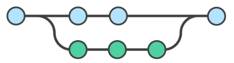

TraceableDict
============

**Traceable Python dictionary, that stores change history in an efficient way inside the object.**

Shahar Azulay, Rinat Ishak

|Travis|_ |Codecov|_ |Python27|_ |Python35|_ |License|_

.. |License| image:: https://img.shields.io/badge/license-BSD--3--Clause-brightgreen.svg
.. _License: https://github.com/shaharazulay/traceable-dict/blob/master/LICENSE
   
.. |Travis| image:: https://travis-ci.org/shaharazulay/traceable-dict.svg?branch=master
.. _Travis: https://travis-ci.org/shaharazulay/traceable-dict

.. |Codecov| image:: https://codecov.io/gh/shaharazulay/traceable-dict/branch/master/graph/badge.svg
.. _Codecov: https://codecov.io/gh/shaharazulay/traceable-dict
    
.. |Python27| image:: https://img.shields.io/badge/python-2.7-blue.svg
.. _Python27:

.. |Python35| image:: https://img.shields.io/badge/python-3.5-blue.svg
.. _Python35:
    

.. _Documentation: https://traceable-dict.readthedocs.io/en/latest/

|Documentation|_

**Usage Examples:**

  Create a traceable dictionary 
   
        >>> from traceable_dict import TraceableDict
        >>> d1 = {'old_key': 'old_value'}
        >>> D1 = TraceableDict(d1)
        >>> D1
        {'old_key': 'old_value', '__trace__': {}, '__revisions__': []}
        >>> D1.revisions
        []
        
  Commit the dictionary for the first time
        
        >>> D1.has_uncommitted_changes
        True
        >>>
        >>> D1.commit(revision=1)
        >>> D1
        {'old_key': 'old_value', '__trace__': {}, '__revisions__': [1]}
        >>> D1.revisions
        [1]
        >>> D1.has_uncommitted_changes
        False
        
  Update the dictionary while tracing the changes
  
        >>> D1['new_key'] = 'new_val'
        >>> D1.trace
        {'_uncommitted_': [(('_root_', 'new_key'), None, '__a__')]}
        >>> D1.has_uncommitted_changes
        True
        >>> D1.commit(revision=2)
        >>> D1.trace
        {'2': [(('_root_', 'new_key'), None, '__a__')]}
        >>> D1.has_uncommitted_changes
        False
        >>> D1.revisions
        [1, 2]

  Checkout previous revisions

        >>> D1.as_dict()
        {'old_key': 'old_value', 'new_key': 'new_value'}
        >>>
        >>> D_original = D1.checkout(revision=1)
        >>> D_original.as_dict()
        {'old_key': 'old_value'}
