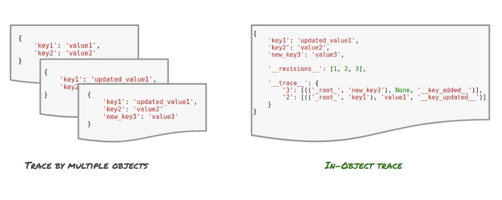

General Concept
-----

Often a Python dictionary object is used to represent a pre-known structured data that captures some state of a system.
A non-relational database such as MongoDB is a great example of such use-case, where the BSON-based documents can easily be loaded into a Python dictionary.
Those dict-like documents help store complex information, whose structure may change over time, and are highly common in the industry.

In cases where the dictionary or JSON-like structure represents a meaningful state of a system, tracing it changes may be a highly valueble part in the monitoring of the system.

This module implements a traceable Python dictionary, that stores change history in an efficient way inside the object.
It allows the user to:

1. **Trace reverions** of the dictionary's content and structure.
2. **Roll the dictionary back** to previously stored values.
3. **Trace the changes** between its different revisions.
4. **Revert** unwanted changes made.
5. **Provide a meaningful id** to the revisions - such as a timestamp, or verison number.
6. More....

.. image:: _static/diff_example.jpg

*[1] tracing the changes in a JSON-like object*

The Solution
-----

There are many possible solutions to trace the changes in a dict-like object. The major differences between them is the way in which the trace history is stored.

The three main possibilities go back to:

1. **In-Object** solution - where the trace is embedded into the dict-like object itself.
2. **Out-Of-Object** solution - where the trace is stored using some additional attribute of the dict-like object.
2. **Trace by Multiple Objects** solution - where the trace is stored by storing multiple copies of the dict-like object, usually equal to the number of known reivisions.

The use of the Out-Of-Object method is not relevant in cases where the object needs to go through serializaion, such as in cases where the object needs to be stored on disk, in a database or in any other non-Python native and consistent form.
Therefore, we chose to not address this solution as viable.

We chose to focus our solution to work well for non-relational DBs, which store document JSON-like documents natively.
The *Trace by Multiple Objects* solution would force the creation of multiple documents in the DB, possibly resulting in a high memory overhead, if objects are kept in full.

However, such solution would provide quick access time for the latest revision of the document.
A possible upgrade of this solution would be to store diffs between document revisions only, but that would possiblt result in a slower accesss time of the latest version.

*[1] In-Objecr and Multiple Objects methods for tracing the changes in a JSON-like object*

We chose to store the trace *In-Object*. While this method is limited by the max allowed size of the document, and may not be suitable for very large documents, we found it to be the most elegant solution.

The trace is stored as part of the dict-like structure of the document allowing **quick access** to the latest revision, while storing only diffs between revision which results in **lower memory costs**.

**Overfitting**

Our meta-level regressor would be exposed to severe overfitting from one of the first level models.
For example, if one of five first level models would be highly overfitted to the target, practically "storing"
the y target it is showns in train time for test time.
The meta-level model, trained over the same target would see this model as excellent - predicting the target y 
with impressive accuracy almost everytime.

This will result in a hight weight to this model, making the entire pipeline useless in test time.

Performance
-----

The solution is never using the train abilities of the first level model - but using their abilities in test.
What does it mean? it means the meta-level model would never be exposed to a y_hat generated by any first level
model where the actual target sample representing this y_hat in the data was given to that model in training.

Each model will deliever its predictions in a "cross_val_predict" manner (in sklearn terms). If it's a great model,
it will demonstrate great generalization skills making its test-time predictions valuable to the meta-level regressor.
If it's a highly overfitted model - the test-time predictions it will hand down the line will be showns for their true
abilities, causing it to recieve a low weight.

How do we achieve that? internal cross validation.

.. image:: _static/figure_002.jpg

*[1] achienving stacking ensemble using internal cross-validation*
