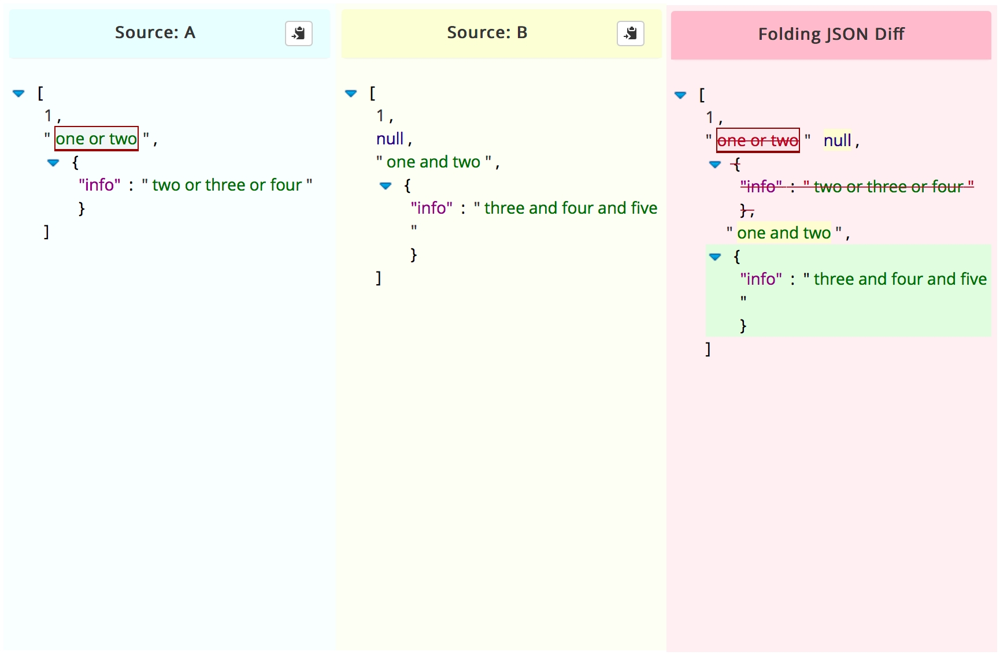

General Concept
-----

Often a Python dictionary object is used to represent a pre-known structured data that captures some state of a system.
A non-relational database such as MongoDB is a great example of such use-case, where the BSON-based documents can easily be loaded into a Python dictionary.
Those dict-like documents help store complex information, whose structure may change over time, and are highly common in the industry.

In cases where the dictionary or JSON-like structure represents a meaningful state of a system, tracing it changes may be a highly valueble part in the monitoring of the system.

This module implements a traceable Python dictionary, that stores change history in an efficient way inside the object.
It allows the user to:

1. **Trace reverions** of the dictionary's content and structure.
2. **Roll the dictionary back** to previously stored values.
3. **Trace the changes** between its different revisions.
4. **Revert** unwanted changes made.
5. **Provide a meaningful id** to the revisions - such as a timestamp, or verison number.
6. More....

*[1] tracing the changes in a JSON-like object*

The Solution
-----

The major problem in creating a proper Stacking ensemble is getting it right.
The wrong way to perform stacking would be to

1. **Train** the first level models over the target.

2. Get the first level models predictions over the inputs.

3. **Train** the meta-level Stacker over the predictions of the first level models.

Why would that be the wrong way to go?

**Overfitting**

Our meta-level regressor would be exposed to severe overfitting from one of the first level models.
For example, if one of five first level models would be highly overfitted to the target, practically "storing"
the y target it is showns in train time for test time.
The meta-level model, trained over the same target would see this model as excellent - predicting the target y 
with impressive accuracy almost everytime.

This will result in a hight weight to this model, making the entire pipeline useless in test time.

Performance
-----

The solution is never using the train abilities of the first level model - but using their abilities in test.
What does it mean? it means the meta-level model would never be exposed to a y_hat generated by any first level
model where the actual target sample representing this y_hat in the data was given to that model in training.

Each model will deliever its predictions in a "cross_val_predict" manner (in sklearn terms). If it's a great model,
it will demonstrate great generalization skills making its test-time predictions valuable to the meta-level regressor.
If it's a highly overfitted model - the test-time predictions it will hand down the line will be showns for their true
abilities, causing it to recieve a low weight.

How do we achieve that? internal cross validation.

.. image:: _static/figure_002.jpg

*[1] achienving stacking ensemble using internal cross-validation*
